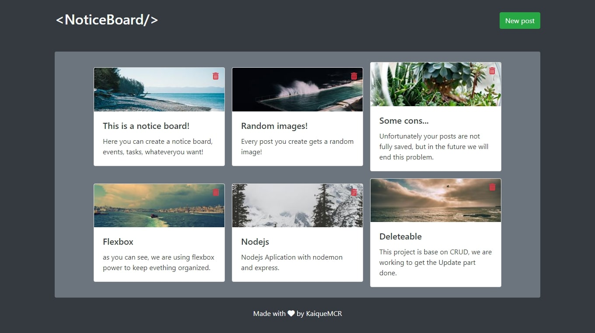

<h1 align="center">&lt;Notice-board/&gt;</h1>

<div align="center">


</div>

<p align="center">
  <a href="#-technologies">Technologies</a>&nbsp;&nbsp;&nbsp;|&nbsp;&nbsp;&nbsp;
  <a href="#-Getting started">Getting started</a>&nbsp;&nbsp;&nbsp;|&nbsp;&nbsp;&nbsp;
  <a href="#-License">License</a>
</p>

🔥 Repo of Notice-board application developed during ProgBr course.

## 📸 Screenshot

[](https://notice-board-production.up.railway.app/)

<p align="center">Click on the image above to see in production 👆</p>

<br>

## 👾 Technologies

- [Nodejs](https://nodejs.org)
- [Express](https://expressjs.com/)
- [Nodemon](https://nodemon.io/)
- [Bootstrap](https://getbootstrap.com/)

<br>

## ▶️ Getting started

⚠️ to run this project you must have installed [Git](https://git-scm.com) and [Node](https://nodejs.org/en/).

1. Clone this repo with:

```bash
$ git clone https://github.com/KaiqueMCR/Notice-board.git
```

2. Install all dependences with:

```bash
$ yarn
```

&nbsp;&nbsp;&nbsp;&nbsp;&nbsp;&nbsp; or

```bash
$ npm install
```

3. Run dev server with:

```bash
$ yarn dev
```

&nbsp;&nbsp;&nbsp;&nbsp;&nbsp;&nbsp; or

```bash
$ npm run dev
```

<br>

## 💪 Contributing

1. Fork the repo on GitHub
2. Clone the project to your own machine
3. Commit changes to your own branch
4. Push your work back up to your fork
5. Submit a Pull request so that we can review your changes

<br>

## 📄 License

[MIT](https://choosealicense.com/licenses/mit/)
